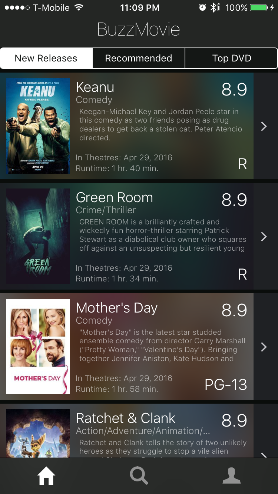
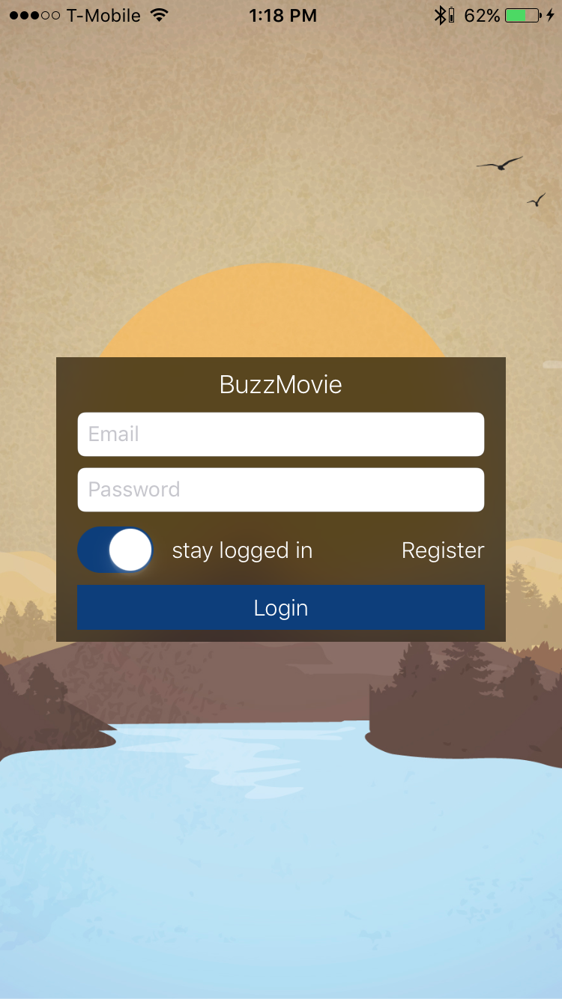
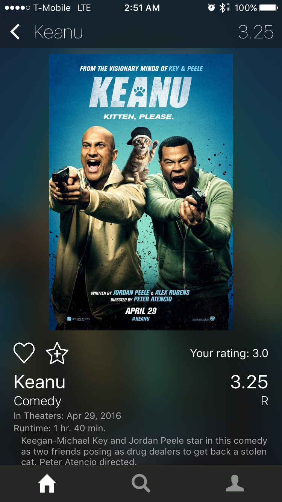
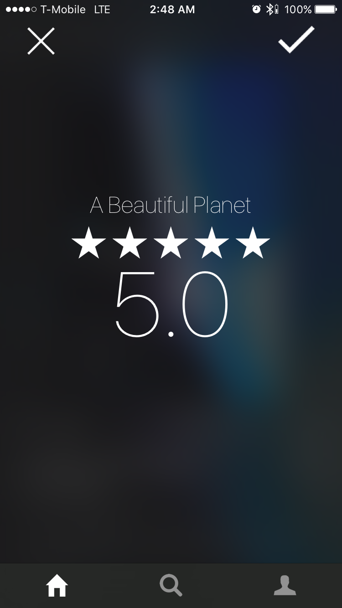
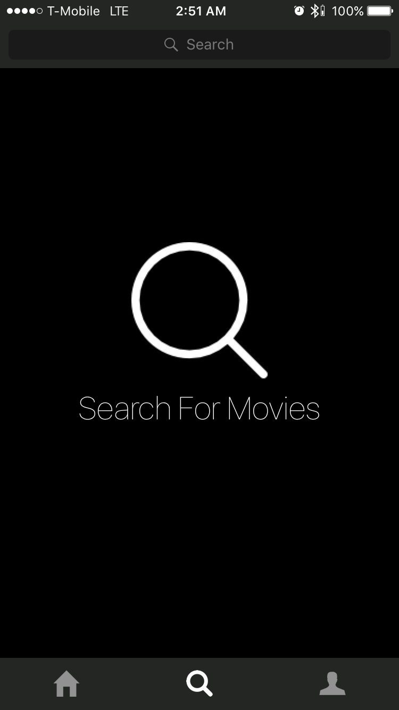
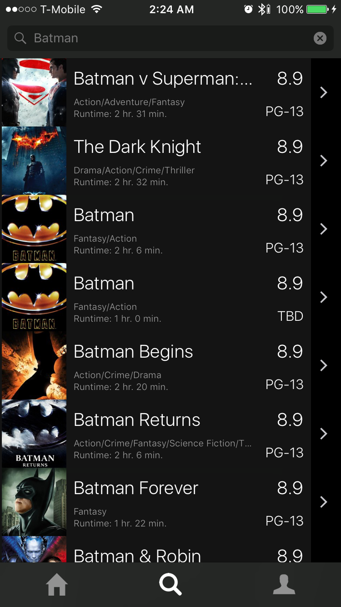

# BuzzMovie
#### Movie App for CS2340 (Object Oriented Design)

###### Tech Used
- Rotten Tomatoes
- TMDB API
- Firebase
- SwiftyJSON
- Alamofire
- Cosmos

 

 
#### Programmed with love by Brian Wang
- [Github: (brianwang9100)](https://github.com/brianwang9100)
- [Email: (brianwang9100@gmail.com)](mailto:brianwang9100@gmail.com)

#### Features
- Query for TopDVDs, New Releases, and Recommendations from users
- Search and keep track of your favorite movies, your movie ratings, and average ratings for each movie across and all users
- Firebase integration
- Fully integrated Rating system
- Admin system (banning and unbanning, locking and unlocking)
- Animations, images, icons, etc.

#### Screenshots
 

 
 

 
 

 
 

 
 

 
 

 
